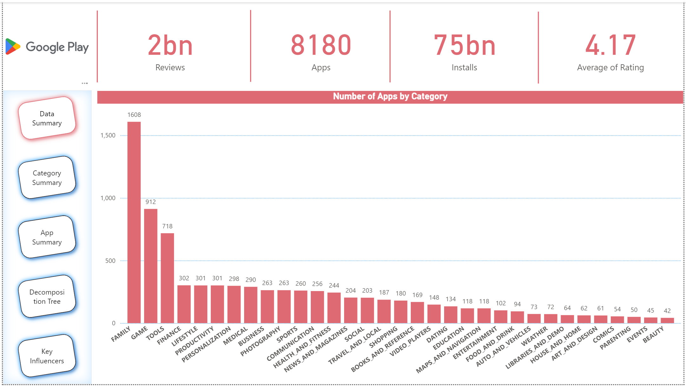

# Business Analytics Dashboard

Interactive Power BI dashboard built to analyze business KPIs, sales trends, and customer insights.

## Tools Used
- Power BI
- Excel
- Data Cleaning
- Data Visualization

## Features
- KPI tracking
- Sales trend analysis
- Interactive visualizations
- Business performance insights

## Dashboard Preview

## Project Files
- dashboard.pbix
- dataset.csv
